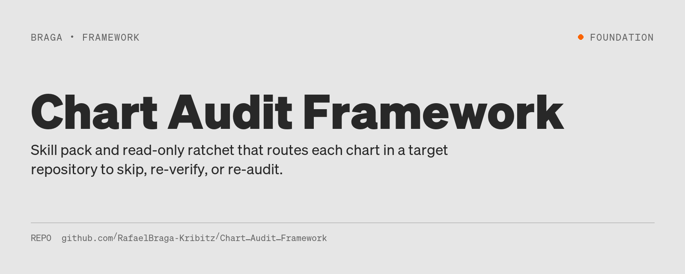
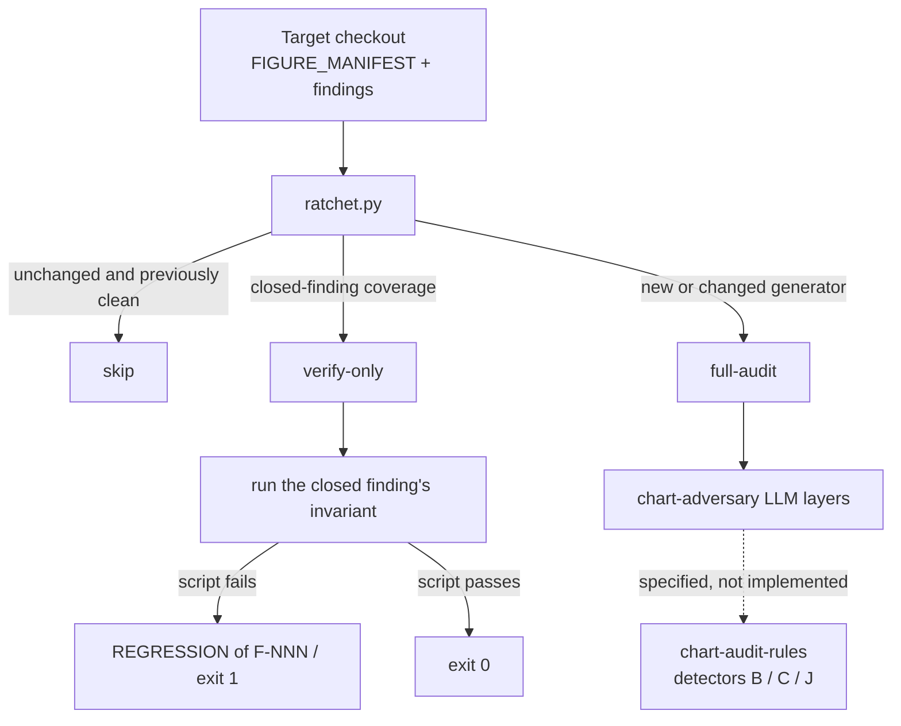

# Chart Audit Framework



[](#status)




**Status:** Foundation
Python 3 · PyYAML · no CI workflow · no license file

Charts that look finished can still encode a flat distribution, a mislabeled interval, or a silently dropped category — and a fresh language-model audit of every figure cannot tell a closed finding from a regression. This framework is the skill pack and read-only ratchet that routes each chart to skip, re-verify, or re-audit against a target repository's figure manifest.

## The idea

Chart review is ordered **upstream-first** (question → logic → type → data/plot) with four hard gates. Three mechanically checkable smells have detector signatures (flat distribution, interval mislabel, dropped categories). The rest stay language-model judged, merged at the report layer, never inside the detector process.

The shipped executable is the **cross-repo ratchet**: it reads `governance/FIGURE_MANIFEST.yaml` and `governance/findings/F-*.yaml` from a [decision-analytics-reconstruction](https://github.com/RafaelBraga-Kribitz/decision-analytics-reconstruction) checkout, then routes each chart id:

| Route | When | What runs |
| --- | --- | --- |
| `skip` | generator hash unchanged and previously clean | nothing |
| `verify-only` | a closed finding covers the chart | that finding's `verification_script` is the authority |
| `full-audit` | new or changed generator | chart-adversary layers; rows marked `llm-judged` until `rules/` detectors exist |

A verify-only failure is reported as `REGRESSION of F-NNN` and exits 1. The ratchet does not file a duplicate issue.

## Project status

The improvement-plan register (`improvement_plan/INDEX.md`) lists IMP-F01–F04 as **filed**. What is actually in this tree:

| ID | Title | In this tree |
| --- | --- | --- |
| IMP-F01 | Deterministic rule engine + numeric rubric anchors | Specs under `rules/` (manifest, detector signatures, scoring anchors, coverage matrix, CLI contract). **No detector implementation.** `chart-audit-rules` does not ship. |
| IMP-F02 | Chart-library verification pipeline | Specified; not the runnable surface of this README. |
| IMP-F03 | Cross-repo audit ratchet | `ratchet/ratchet.py` is present and is the only command documented here. |
| IMP-F04 | Repo hygiene | Specified; independent of the ratchet. |

No results exist yet from a detector CLI: that CLI is specified and not implemented. Full-audit rows carry `llm-judged` until IMP-F01 is implemented.

## Quick start

Requires Python 3 and PyYAML. Point the ratchet at a target checkout that has `governance/FIGURE_MANIFEST.yaml` (`schema_version` 1) and `governance/findings/F-*.yaml`.

```bash
pip install pyyaml
python3 ratchet/ratchet.py <target_checkout> [--state PATH] [--report PATH]
                           [--no-verify] [--rewind]
```

- `--no-verify` — route only; do not execute the target's verification scripts.
- `--rewind` — required if the target HEAD is an ancestor of the commit recorded in `ratchet/state.json`.
- Unsupported or absent `schema_version` aborts (exit 2). Unknown finding ids in `ratchet/finding_chart_map.yaml` abort (exit 2).

Measured on the target's 41-chart manifest: no-delta routing 0.18 s; full verify-only (15 unique invariant scripts, memoized) ~21 s.

The specified detector CLI — **not implemented** — would be:

```
chart-audit-rules <chart_path> <code_path> [--manifest rules/manifest.yaml]
                  [--expected-categories <file>] [--interval-labels <file>]
```

## Explore this project

| Path | Start here |
| --- | --- |
| Fast path | [The idea](#the-idea) and the workflow diagram above |
| Deep path | [Validation](#validation), [Architecture](#architecture), `rules/cli-spec.md`, `rules/detectors_spec.md`, `ratchet/README.md` |

## Validation

Acceptance is exit-code behaviour, not a published chart score.

**Ratchet** (`ratchet/ratchet.py`):

| Code | Meaning |
| --- | --- |
| 0 | Ran; no closed-finding regressions |
| 1 | At least one closed-finding `REGRESSION` |
| 2 | Input / manifest error (unsupported `schema_version`, missing manifest, mapping-table schema violation, backwards run without `--rewind`) |

**Specified detector CLI** (`rules/cli-spec.md`; not implemented):

| Code | Meaning |
| --- | --- |
| 0 | All executed detectors clean (`fired = 0`); skips allowed but reported |
| 1 | At least one detector fired |
| 2 | Input / manifest error |

A skipped detector is reported as `skipped`, never as `clean`. A detector result is never silently overridden by a language-model verdict. Input errors are never reported as "no smell."

Specified detectors (signatures only):

| Smell | Function | Fires when |
| --- | --- | --- |
| B | `detect_flat_distribution` | every group's `std` of the metric is below threshold and there are ≥ 2 groups |
| C | `detect_interval_mislabel` | declared interval type/level disagrees with the quantiles used |
| J | `detect_dropped_categories` | `expected − plotted` is non-empty |

## Architecture

```
target checkout                     this repository
─────────────────                   ────────────────
FIGURE_MANIFEST.yaml  ──reads──►    ratchet/ratchet.py
findings/F-*.yaml     ──reads──►        │
verification_script   ◄──runs──         │  verify-only
                                        │
                                   ratchet/state.json
                                   ratchet/finding_chart_map.yaml
                                        │
                                   rules/manifest.yaml     (registry)
                                   rules/detectors_spec.md (B, C, J)
                                   rules/cli-spec.md       (not implemented)
                                        │
                                   chart-audit/            (LLM skill)
                                   chart-expert/           (LLM skill)
```

The ratchet is strictly read-only against the target. State (per-chart generator hash, verdict, rule-version hash, target commit) lives in `ratchet/state.json`. Generator hashing is file-level: a change to a shared chart factory re-audits every non-invariant-covered chart that factory generates.

Language-model judged rules stay outside `chart-audit-rules`; their verdicts come from the chart-adversary agent and are merged at the report layer. The CLI, once implemented, has no network access.

IMP-F01 is the dependency for the ratchet's detector path. IMP-F03 can already route and re-verify closed findings without those detectors. IMP-F02 and IMP-F04 do not block IMP-F03.

## Limitations

- **IMP-F01 is not implemented.** Three detector signatures exist; the process `chart-audit-rules` does not. Full-audit still means language-model layers.
- **Most of the rule registry is language-model judged.** Detector-backed today: smells B, C, J. Gates A–D and smells A, D–I, K–M have no deterministic detector.
- **The ratchet does not write the target.** Reopening a regressed finding is the target repository's governance action.
- **Coverage is only what the manifest names.** Charts absent from `FIGURE_MANIFEST.yaml` are not routed.
- **File-level dirty detection is conservative.** Editing a shared generator re-audits every chart it produces that is not verify-only.
- **No CI workflow** and **no license file** in this repository.
- **The improvement-plan register still says filed** for IMP-F01–F04 even though the IMP-F03 ratchet script is in the tree.

What would change this status: an implementation of `rules/cli-spec.md` that exits 0/1/2 as specified, wired so full-audit rows are no longer `llm-judged` for smells B, C, and J.

## Repository structure

```
chart-audit/           Adversary skill: 9 layers, gates A–D, code smells
chart-expert/          Chart-selection skill and library (verification is IMP-F02)
rules/                 Rule registry, detector signatures, CLI contract, anchors
ratchet/               Cross-repo ratchet (the runnable entry point)
improvement_plan/      IMP-F01–F04 specifications (register: filed)
docs/design-history/   Why the audit is top-down
```

## Status

**Status:** Foundation

Last described against `improvement_plan/INDEX.md`, `ratchet/README.md`, `rules/cli-spec.md`, and `rules/detectors_spec.md`.

Repository last updated 2026-09-16 (date of the last commit).

## License

No license file is present in this repository. Contents are unpublished as to license until one is added.

## Author

<table>
  <tr>
    <td>
      <strong>Rafael Braga-Kribitz</strong><br />
      Seiersberg-Pirka, Austria · Portfolio project, 2026<br />
      <a href="https://www.linkedin.com/in/rafaelbragakribitz/">LinkedIn</a>
      ·
      <a href="mailto:rafaelbragakribitz@gmail.com">rafaelbragakribitz@gmail.com</a>
    </td>
  </tr>
</table>
